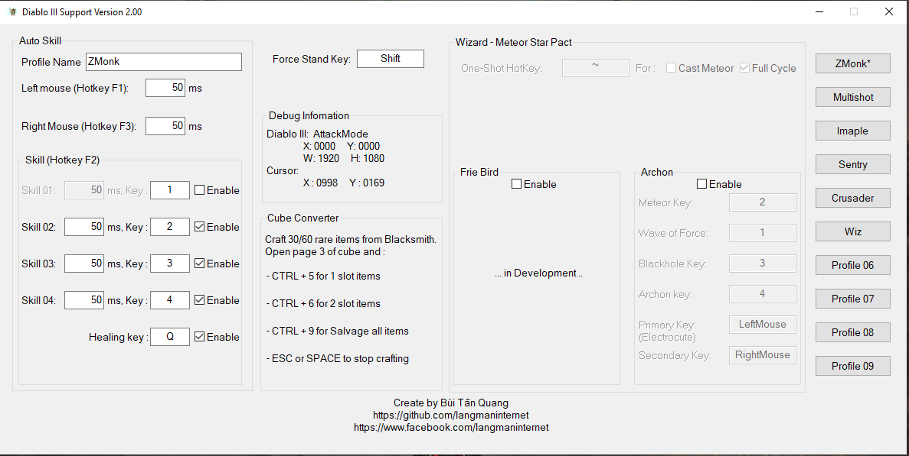

# Diablo III Support tool
An open-source Dialo III Support tool

Link download (Source code + Tool)
------------
Latest stable version

https://github.com/langmaninternet/DialoIIISupport/releases

If you get error with mfc140u.dll , install Visual C++ Redistributable for Visual Studio 2015

https://www.microsoft.com/en-gb/download/details.aspx?id=48145

Features : Auto use skill over time with smart handling situations
------------

F1 to on/off auto left mouse click

F2 to on/off auto skill 1 2 3 4 an healing Q (On Full-HD Resolution, F2 auto stop at town)

F3 to on/off auto right mouse click

Features : Cube converter
------------

Craft 30/60 rare item, go to Cube, open page 3. 

Press CTRL + 5 for 1 slot items,  

CTRL + 6 for 2 slot items .

CTRL + 7 to drop all item in Inventory to ground

CTRL + 9 if you want to clear the Inventory at the Blacksmith

ESC or SPACE to Stop 

Features : Wizard LoN32 Archon Macro
------------
Use 1 hotkey to call full-cycle of StarPact

Auto cast Lightning Blast when it's ready. Note : **Lightning Blast use Skill 01 key to cast**.

Only work on
+ Resolution is 1920x 1080 
+ Game is Fullscreen or Fullscreen Windows Mode

Screenshot
------------

