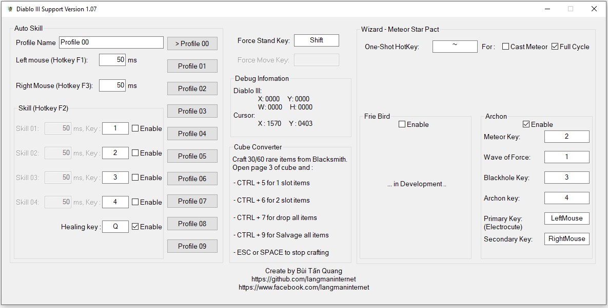

# Diablo III Support tool
An open-source Dialo III Support tool

Link download (Source code + Tool)
------------
Latest stable version
https://github.com/langmaninternet/DialoIIISupport/releases

Current developing version
https://github.com/langmaninternet/DialoIIISupport/archive/master.zip

If you get error with mfc140u.dll : 

Install Visual C++ Redistributable for Visual Studio 2015

https://www.microsoft.com/en-gb/download/details.aspx?id=48145

Features : Auto use skill over time
------------

F1 to on/off auto left mouse click

F2 to on/off auto skill 1 2 3 4 an healing Q

F3 to on/off auto right mouse click

(Smart handling situations)

Features : Cube converter
------------

Craft 30/60 rare item, go to Cube, open page 3. 

Press CTRL + 5 for 1 slot items,  

CTRL + 6 for 2 slot items .

CTRL + 7 to drop all item in Inventory to ground

CTRL + 9 if you want to clear the Inventory at the Blacksmith

ESC or SPACE to Stop 

Features : Wizard LoN32 Archon Macro
------------
Use 1 hotkey to call full-cycle of StarPact

Features : [Smart] Lightning Blast
------------
Auto cast Lightning Blast when it's ready. (Note : Lightning Blast use Skill 01 key to cast)

Only work on

+ Resolution is 1920x 1080 
+ Game is Fullscreen or Fullscreen Windows Mode

Ưu điểm so với macro của bàn phím hoặc các tool khác đã có
------------

+ Các skill được gọi đều đặn có tính toán chống chồng lấp, nên không bị trôi/nuốt skill khi sử dụng nhiều skill.

+ Có thêm tính năng bán và sửa đồ, rất tiện khi đi GR Speed. (Lúc về thành thì lọc đồ, đồ ngon cất vào Stash, xong ra thợ rèn, bấm Ctrl + 9 là tự bán đồ và sửa đồ)

+ Nếu bạn di chuột ra khỏi game thì auto F1 sẽ trở thành giữ Force Stand + LeftMouse. Nếu bạn di chuột ra khỏi game thì auto F3 sẽ trở thành giữ Force Stand + RightMouse. (Rất tiện khi bạn chơi zmonk, bạn lỡ click chuột ra ngoài thì nhân vật bạn sẽ đứng im 1 chỗ và tank quái)

Tự động bấm skill theo thời gian
------------

Bật tool, vào game, bấm F1 để bật/tắt tự động bấm chuột trái

Bật tool, vào game, bấm F2 để bật/tắt tự động sử dụng skill ( dùng những skill mà bạn đã chọn Enable trong khung Skill của tool) 

Bật tool, vào game, bấm F3 để bật/tắt tự động bấm chuột phải

Hỗ trợ craft đồ từ cube
------------
Craft 60 đồ vàng 1 lỗ (rare item) hoặc 30 đồ vàng 2 lỗ (rare item), xong ra cube, mở page 3 lên. 

Xong sử dụng:

 Ctrl + 5 để update đồ 1 lỗ
 
 Ctrl + 6 để update đồ 2 lỗ
 
 Ctrl + 7 để vất hết đồ ra sàn
 
 Ctrl + 9 để đập hết đồ ở thợ rèn ( Cần phải ra thợ rèn trước)
 
 ESC hoặc SPACE để stop lúc đang craft

Screenshot
------------

