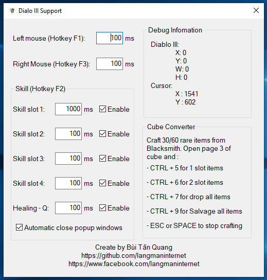
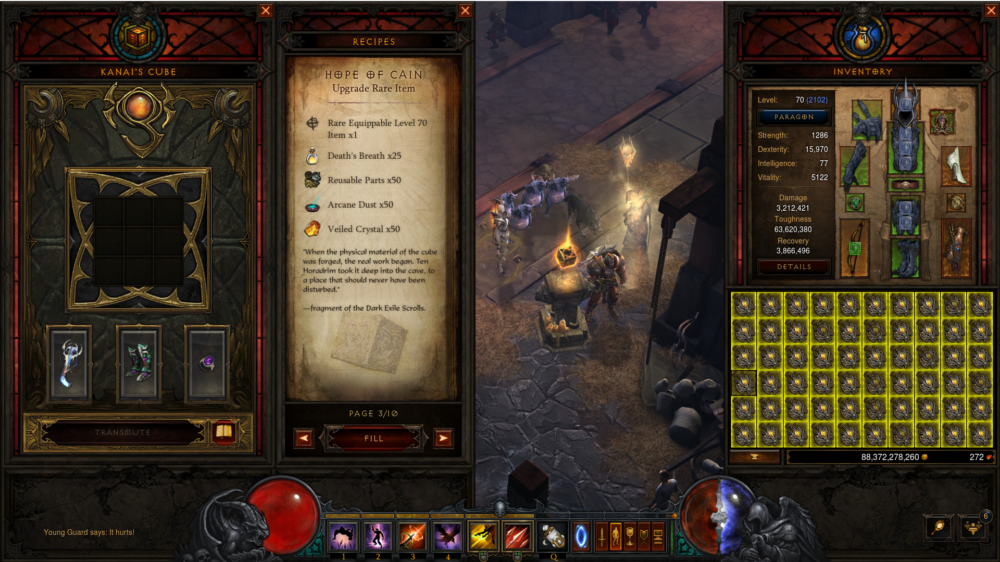

# Dialo III Support tool
An open-source Dialo III Support tool

Tính năng
------------
+ Tự động bấm skill theo thời gian. 
Không bị chồng lấp khi sử dụng skill nên không bị leak mất skill nào
Send key trực tiếp tới Diablo, không bị rối loạn khi ở màn hình hoặc các cửa số khác

+ Hỗ trợ craft đồ từ cube
Craft 60 đồ vàng 1 lỗ (rare item) hoặc 30 đồ vàng 2 lỗ (rare item), xong ra cube, mở page 3 lên. 
Xong sử dụng:
 Ctrl + 5 để update đồ 1 lỗ
 Ctrl + 6 để update đồ 2 lỗ
 Ctrl + 7 để vất hết đồ ra sàn
 Ctrl + 9 để đập hết đồ ở thợ rèn ( Cần phải ra thợ rèn, mở trang Salvage đồ trước)

Screenshot
------------

