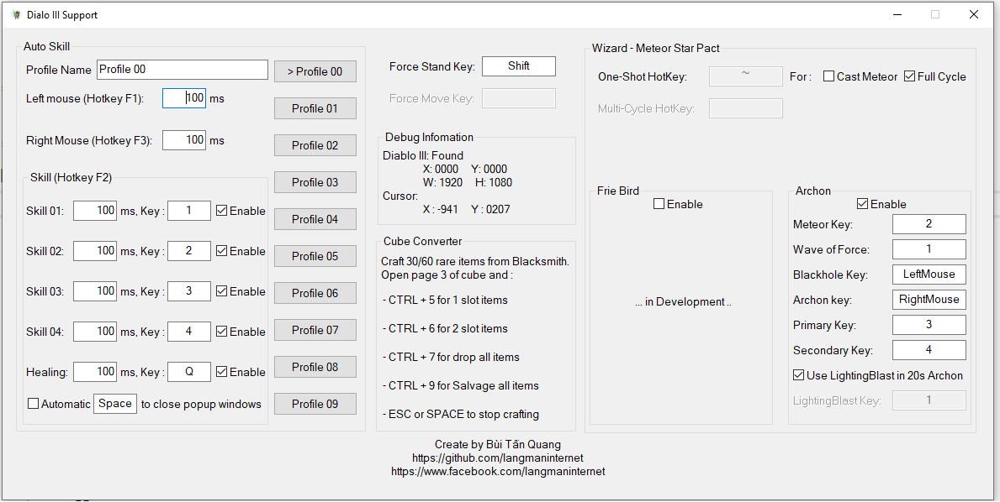
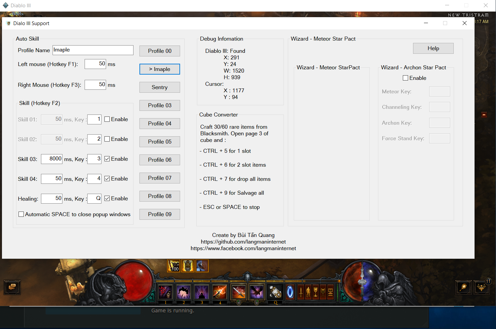

# Dialo III Support tool
An open-source Dialo III Support tool

Link download (Source code + Tool)
------------
https://github.com/langmaninternet/DialoIIISupport/archive/master.zip

If you get error with mfc140u.dll : 

Install Visual C++ Redistributable for Visual Studio 2015

https://www.microsoft.com/en-gb/download/details.aspx?id=48145

Source code
------------
https://github.com/langmaninternet/DialoIIISupport

Features : Auto use skill over time
------------

F1 to auto left mouse click

F2 to auto skill 1 2 3 4 an healing Q

F3 to auto right mouse click

Features : Cube converter
------------

Craft 30/60 rare item, go to Cube, open page 3. 

Press CTRL + 5 for 1 slot items,  

CTRL + 6 for 2 slot items .

CTRL + 7 to drop all item in Inventory to ground

CTRL + 9 if you want to clear the Inventory at the Blacksmith

ESC or SPACE to Stop 

Ưu điểm so với macro của bàn phím hoặc các tool khác đã có
------------

Các skill được gọi đều đặn có tính toán chống chồng lấp, nên không bị trôi/nuốt skill khi sử dụng nhiều skill.

Có thêm tính năng bán và sửa đồ, rất tiện khi đi GR Speed. (Lúc về thành thì lọc đồ, đồ ngon cất vào Stash, xong ra thợ rèn, bấm Ctrl + 9 là tự bán đồ và sửa đồ)

Tự động bấm skill theo thời gian
------------

Bật tool, vào game, bấm F1 để bật/tắt tự động bấm chuột trái

Bật tool, vào game, bấm F2 để bật/tắt tự động sử dụng skill ( dùng những skill mà bạn đã chọn Enable trong khung Skill của tool) 

Bật tool, vào game, bấm F3 để bật/tắt tự động bấm chuột phải

Tự động đóng các cửa sổ popup trong game
------------
Auto close popup Windows : Tự động bấm Space trước khi gọi skill để đóng các cửa sổ popup trong game (Không thích hợp với những người dùng Space cho force stand)

Hỗ trợ craft đồ từ cube
------------
Craft 60 đồ vàng 1 lỗ (rare item) hoặc 30 đồ vàng 2 lỗ (rare item), xong ra cube, mở page 3 lên. 

Xong sử dụng:

 Ctrl + 5 để update đồ 1 lỗ
 
 Ctrl + 6 để update đồ 2 lỗ
 
 Ctrl + 7 để vất hết đồ ra sàn
 
 Ctrl + 9 để đập hết đồ ở thợ rèn ( Cần phải ra thợ rèn trước)
 
 ESC hoặc SPACE để stop lúc đang craft

Screenshot
------------

